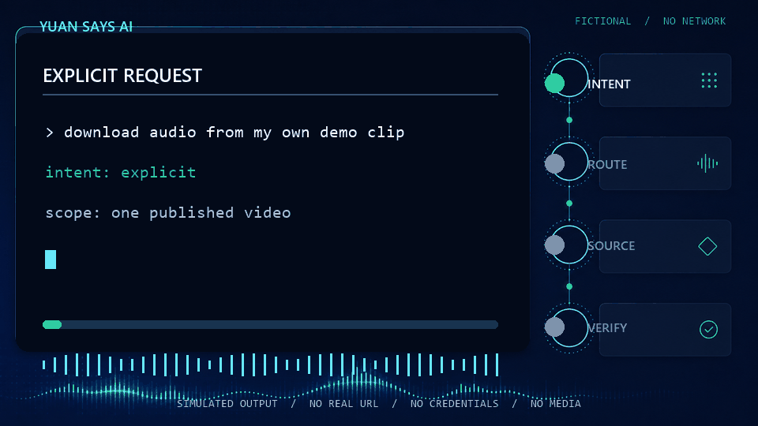

# Codex Audio Download Skills

[](https://github.com/Qiyuanr/codex-audio-download-skills/actions/workflows/tests.yml)
[](LICENSE)
[](https://www.python.org/)

**English** · [简体中文](README.zh-CN.md)

Four installable Codex Skills for extracting the best audio stream currently available from one authorized Bilibili, Douyin, or YouTube video. The site-specific Skills only activate when the user explicitly asks to download or extract audio; a shared runtime validates the result with FFprobe and avoids needless lossy transcoding.

An open-source project from **Yuan Says AI**.

> This project does not bypass DRM, paywalls, account entitlements, or region restrictions. Use it only for content you own or are otherwise authorized to process.

<p align="center">
  
</p>

<p align="center"><sub>This 25-second demo is entirely fictional and performs no network request. It contains no real media, credentials, signed URLs, titles, or personal paths.</sub></p>

## Why this project

Converting an already compressed stream to MP3, M4A, or FLAC does not restore lost detail and may add another lossy encode. This project instead focuses on:

- selecting the best stream that the page and `yt-dlp` actually expose;
- preserving the source codec whenever possible, with container-only remuxing when needed;
- verifying that the final file has audio and no video stream;
- preventing bare-link activation, output-path escapes, silent overwrites, and credential leaks;
- keeping each site's trigger narrow while sharing one reviewed runtime.

This repository is also the first public example for [Agent Skill Release Kit](https://github.com/Qiyuanr/agent-skill-release-kit). Its `.skill-release.yml` allowlists only the generated fictional GIF by exact path and SHA-256, and the current tree audits as `ready` under that tool's v0.1 rules. `ready` is a ruleset result, not a guarantee of absolute safety.

## Included Skills

| Skill | Role | Activates on |
| --- | --- | --- |
| `download-bilibili-audio` | Bilibili wrapper | Explicit audio-download intent plus a `bilibili.com` or `b23.tv` link |
| `download-douyin-audio` | Douyin wrapper | Explicit audio-download intent plus a `douyin.com` or `iesdouyin.com` link |
| `download-youtube-audio` | YouTube wrapper | Explicit audio-download intent plus a `youtube.com`, `youtu.be`, or `youtube-nocookie.com` link |
| `download-best-audio` | Shared deterministic runtime | Explicit maintenance or direct invocation; implicit activation is disabled |

A bare link, or a request to open, read, summarize, or discuss a link, does **not** trigger a download.

## Quick start

### 1. Install runtime dependencies

- Python 3.10+
- [`yt-dlp`](https://github.com/yt-dlp/yt-dlp)
- [FFmpeg and FFprobe](https://ffmpeg.org/)
- [Deno](https://deno.com/) for YouTube; optional for Bilibili and Douyin

The repository does not bundle third-party executables. After following each dependency's official installation instructions, check:

```text
python --version
yt-dlp --version
ffmpeg -version
ffprobe -version
deno --version
```

### 2. Install all four Skills

#### Option A — repository plugin marketplace

The repository contains a canonical plugin at `plugins/codex-audio-download-skills/` and a repo marketplace at `.agents/plugins/marketplace.json`. Install the tagged `v0.1.0` release with:

```bash
codex plugin marketplace add Qiyuanr/codex-audio-download-skills --ref v0.1.0
codex plugin add codex-audio-download-skills@yuan-says-ai-audio
```

Start a new Codex session after installation. The marketplace loads the plugin through the local, repository-relative path `./plugins/codex-audio-download-skills`. This is a repository marketplace, not a listing in OpenAI's universal public Plugins Directory. The commands above will work after the `v0.1.0` tag is published; review the source before installing.

#### Option B — standalone Skills

Copy **all four** directories under `plugins/codex-audio-download-skills/skills/` to one of the current Agent Skills locations:

| Scope | Destination |
| --- | --- |
| Current repository | `<repo-root>/.agents/skills/` |
| All repositories for the current user | `$HOME/.agents/skills/` |

Keep the four directories as siblings because each site wrapper calls `download-best-audio`. Start a new session after copying. You can then inspect installed Skills with `/skills` and explicitly invoke one with `$download-youtube-audio`, for example.

The paths above follow the current [OpenAI Agent Skills documentation](https://learn.chatgpt.com/docs/build-skills). Older copies of this README referenced `$CODEX_HOME/skills`; use `.agents/skills` for new standalone installs.

### 3. Ask with explicit intent

```text
Download the audio from this one YouTube video that I am authorized to process: <paste URL>
```

```text
提取这个已获授权的 B 站单视频音频：<粘贴链接>
```

If you only paste a link or ask Codex to summarize it, the Skills remain inactive.

## What “best audio” means

“Best” means the highest-ranked audio stream `yt-dlp` can identify and access for the page at that time, in the current region and account context. It does not mean a platform master, a lossless source, or a tier available to every account.

Platforms often expose AAC or Opus. Converting those streams to FLAC cannot recover discarded information. Extractor behavior also changes over time, so real-site availability cannot be guaranteed.

## Behavior and safety controls

- Processes exactly one published video at a time.
- Uses `bestaudio/best` and rejects playlist-only URLs and active livestreams.
- Downloads and verifies in a temporary directory, then commits the final file.
- Preserves the source codec and reports remuxing separately from transcoding.
- Uses Windows-safe filenames while preserving Unicode where possible.
- Does not overwrite an existing file unless the direct caller explicitly requests force mode.
- Launches external programs with argument arrays and `shell=False`.
- Tries public access first. Browser cookies may be used only after per-link user approval.
- Never exports cookie files or intentionally logs credentials or signed media URLs.
- Returns structured JSON with stable error codes.

## Compatibility

### Codex and ChatGPT surfaces

| Packaging route | Supported surface | Notes |
| --- | --- | --- |
| Standalone Agent Skills | ChatGPT desktop app, Codex CLI, Codex IDE extensions | OpenAI documents standalone Skills across these surfaces. Use `.agents/skills` locations above. |
| Repository plugin marketplace | Codex CLI | Add the marketplace and plugin with the commands above. |
| Repository plugin marketplace | ChatGPT desktop app in Work mode | Repo marketplaces are discovered from `.agents/plugins/marketplace.json`; restart the app, then install from the Plugins Directory. |
| Repository plugin marketplace | Other surfaces | Local and repo marketplace availability varies; use standalone Skills when the marketplace is unavailable. |

See OpenAI's current [Skills](https://learn.chatgpt.com/docs/build-skills) and [plugin packaging](https://developers.openai.com/plugins/build/plugins) documentation for host-specific changes.

### Runtime and CI

| Environment | CI coverage | Runtime notes |
| --- | --- | --- |
| Windows | Python 3.10 and 3.12 | Default output uses the user's Downloads directory; Windows-safe path checks are enabled. |
| Ubuntu | Python 3.12 | POSIX path and filename limits are tested. |
| macOS | Python 3.12 | POSIX runtime; install dependencies separately. |

Unit tests use mocks and generated data. CI does not download copyrighted platform media.

## Scope

Supported:

- one published video per request;
- normal video URLs and common share-link domains for Bilibili, Douyin, and YouTube;
- best-available audio selection, extraction, validation, and safe finalization.

Not supported:

- playlists, batches, or active livestreams;
- DRM-protected content;
- paywall, membership, account-entitlement, or region-restriction bypass;
- proxy-based or third-party-parser bypasses.

## Direct runtime use

Codex handles input transport when a Skill runs. For direct script use, read user-controlled values interactively, encode them as UTF-8 Base64 in memory, and pass only the encoded value to the process.

PowerShell:

```powershell
$mediaUrl = Read-Host "Authorized video URL"
$urlBase64 = [Convert]::ToBase64String([Text.Encoding]::UTF8.GetBytes($mediaUrl))
py -3 .\plugins\codex-audio-download-skills\skills\download-best-audio\scripts\download_audio.py --url-base64 $urlBase64
```

Bash:

```bash
read -r -p 'Authorized video URL: ' media_url
url_base64="$(printf '%s' "$media_url" | base64 | tr -d '\r\n')"
python3 ./plugins/codex-audio-download-skills/skills/download-best-audio/scripts/download_audio.py --url-base64 "$url_base64"
```

Base64 is an argument-transport measure, not encryption. Do not paste raw URLs, output paths, or browser profiles into a shell command. The positional interface exists only for callers that construct an argument array without shell parsing.

## Privacy, security, and responsible use

Before filing an issue, remove usernames, absolute paths, cookies, tokens, browser-profile details, signed media URLs, private titles, and downloaded media. Submit only the sanitized error code, dependency versions, and a minimal reproduction. See [SECURITY.md](SECURITY.md) for private vulnerability reporting and the supported-version policy.

This project does not grant permission to download any content. Non-commercial use does not automatically satisfy copyright law or platform terms. Prefer official download or export features, and verify the license, authorization, applicable law, and platform terms for every item you process:

- [YouTube Terms of Service](https://www.youtube.com/t/terms)
- [Bilibili User Agreement](https://www.bilibili.com/protocal/licence.html)
- [Douyin User Service Agreement](https://www.douyin.com/agreements/?id=6773906068725565448)

The project is not affiliated with or endorsed by OpenAI, Bilibili, Douyin, YouTube, `yt-dlp`, or FFmpeg. Names and trademarks belong to their respective owners.

## Development

```text
python -m compileall -q plugins/codex-audio-download-skills/skills scripts tests
python -m unittest discover -s tests -v
```

Plugin packaging can also be checked with OpenAI's bundled `plugin-creator` validator. The four Skill folders should each pass `skill-creator`'s `quick_validate.py`. See [CONTRIBUTING.md](CONTRIBUTING.md) for the contribution and privacy checklist.

The ready-to-upload GitHub social card is [docs/assets/social-preview.png](docs/assets/social-preview.png). Its source artwork and the GIF source artwork were generated without text; [scripts/generate_demo_assets.py](scripts/generate_demo_assets.py) adds the exact fictional copy and deterministic dimensions.

## Release

See the notes for the first tagged release in [docs/release-notes-v0.1.0.md](docs/release-notes-v0.1.0.md).

## License

Original code in this repository is licensed under the [MIT License](LICENSE). Third-party dependencies keep their own licenses; see [THIRD_PARTY_NOTICES.md](THIRD_PARTY_NOTICES.md).
